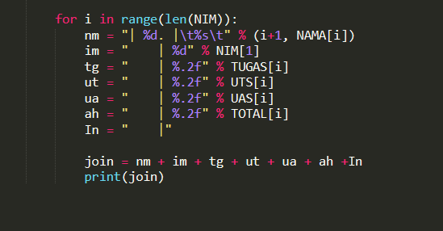

# pertemuan9

## PEMBUATAN PROGRAM SEDERHANA untuk menambahkan data kedalam sebuahlist dengan rincian, untuk data nilai akhir.

Disini saya menggunakan code editor sublime text,

### penjelasan pembuatan program
buat lah sintax list nama, nim dst, seperti pada gambar

setelahnya kita akan menngunakan "while true" (perulangan)
dan penggabungan yaitu "append"
cth seperti di gambar

dan untuk perulangan agar data dapat di jalankan berkali kali, masukkan sintax berikut ini

terakhir untuk tabel

dan hasil akhirnya akan seperti ini

flowchart pembuatan program tsb

# terimakasih 